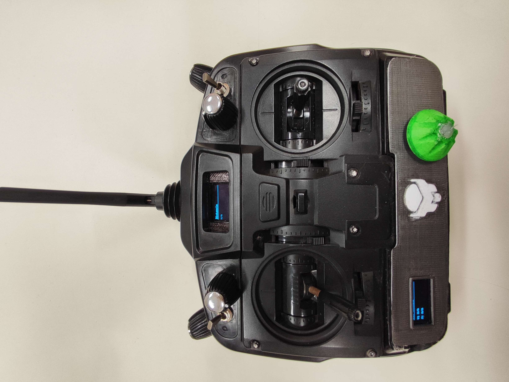
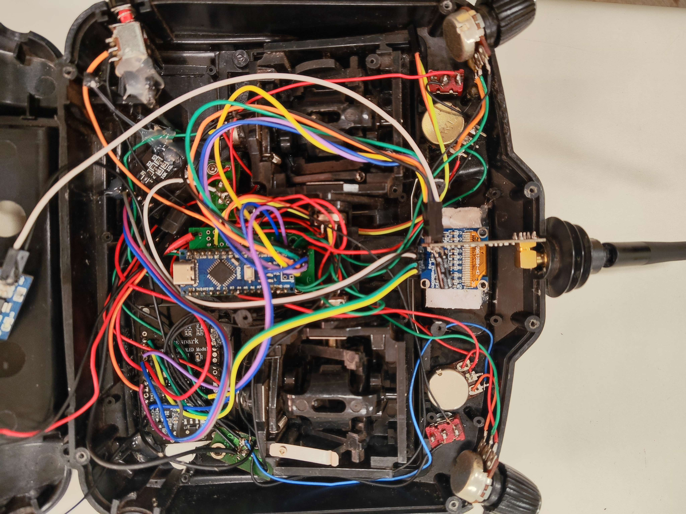
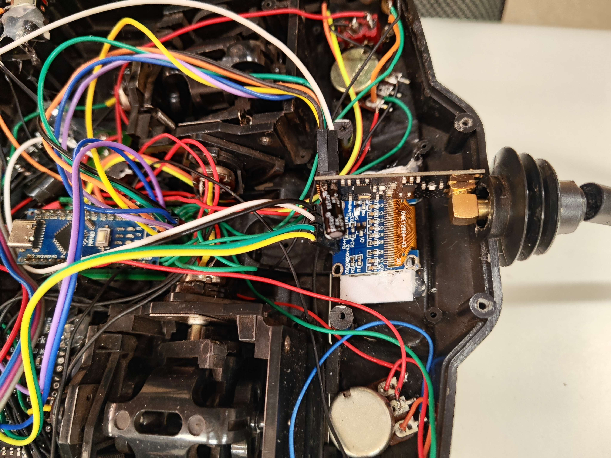
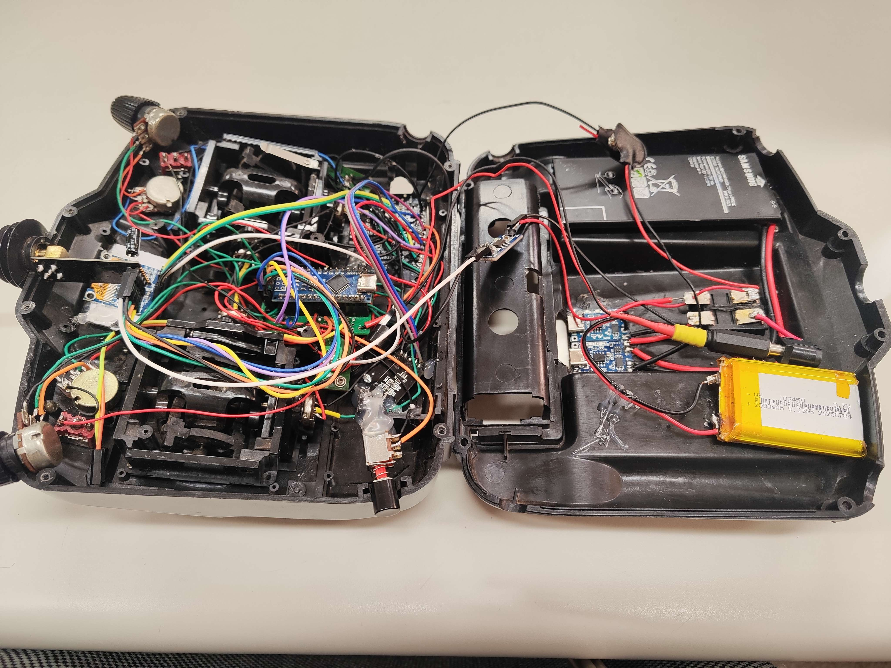
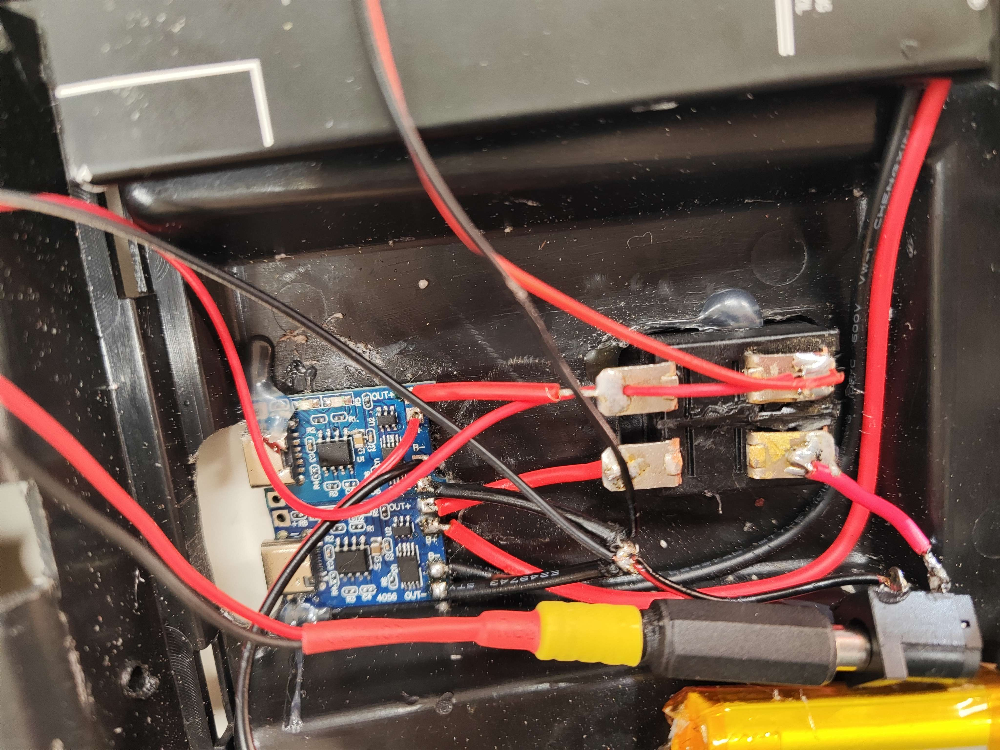
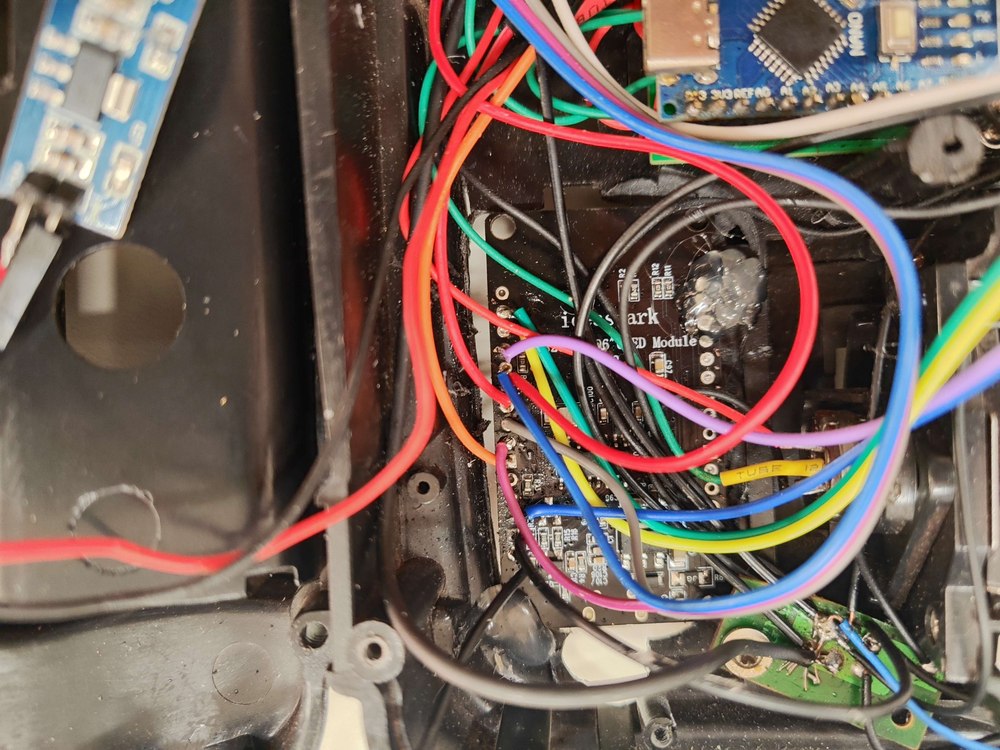

# OpenRC AeroLink

**OpenRC AeroLink** é um sistema open-source de controle remoto sem fio modular, desenvolvido para funcionar tanto em **simuladores de PC** quanto em **aeronaves reais**.  
Baseado em **Arduino (Nano/Mega)**, **ESP8266/ESP32** e **nRF24L01 PA/LNA**, o projeto combina **transmissão robusta**, **HUD visual** em OLEDs e **arquitetura expansível**.

---

## 🤖 Sistema WALL-E (Tank Drive RC)

O **WALL-E** é um subsistema de controle RC para veículos terrestres com tração diferencial (tank drive), composto por três módulos Arduino que se comunicam via rádio nRF24L01 e UART.

### 📋 Descrição dos Módulos

| Módulo | Plataforma | Função |
|--------|------------|--------|
| **NANO_TX** | Arduino Nano | Transmissor de mão com 7 potenciômetros + 4 switches |
| **NANO_RX** | Arduino Nano | Receptor no veículo, controla servos locais e retransmite via UART |
| **MEGA** | Arduino Mega 2560 | Controlador principal com ponte H L298N + 8 servos |

### 🔌 Esquema de Ligações

#### NANO_TX (Transmissor)

```
┌─────────────────────────────────────────────────────────┐
│                     ARDUINO NANO                        │
├─────────────────────────────────────────────────────────┤
│  nRF24L01        │  Potenciômetros    │  Switches       │
│  ─────────       │  ──────────────    │  ─────────      │
│  CE    → D8      │  POT0 → A0         │  SW1 → D2       │
│  CSN   → D7      │  POT1 → A1         │  SW2 → D3       │
│  MOSI  → D11     │  POT2 → A2         │  SW3 → D4       │
│  MISO  → D12     │  POT3 → A3         │  SW4 → D5       │
│  SCK   → D13     │  POT4 → A4         │  (INPUT_PULLUP) │
│  VCC   → 3.3V    │  POT5 → A5         │                 │
│  GND   → GND     │  POT6 → A6         │                 │
└─────────────────────────────────────────────────────────┘
```

#### NANO_RX (Receptor)

```
┌─────────────────────────────────────────────────────────┐
│                     ARDUINO NANO                        │
├─────────────────────────────────────────────────────────┤
│  nRF24L01        │  Servos (Locais)   │  UART → MEGA    │
│  ─────────       │  ──────────────    │  ───────────    │
│  CE    → D8      │  SERVO0 → D3       │  TX0 (D1) ────┐ │
│  CSN   → D7      │  SERVO1 → D5       │               │ │
│  MOSI  → D11     │  SERVO2 → D6       │  Debug:       │ │
│  MISO  → D12     │  SERVO3 → D9       │  SoftSerial   │ │
│  SCK   → D13     │  SERVO4 → D10      │  TX → D4      │ │
│  VCC   → 3.3V    │  SERVO5 → A0 (14)  │               │ │
│  GND   → GND     │  SERVO6 → A1 (15)  │               │ │
│                  │  SERVO7 → A2 (16)  │               │ │
└──────────────────┴───────────────────┴───────────────┴─┘
                                                        │
                              ┌─────────────────────────┘
                              ▼
┌─────────────────────────────────────────────────────────┐
│                    ARDUINO MEGA 2560                    │
├─────────────────────────────────────────────────────────┤
│  UART (de NANO_RX)                                      │
│  ─────────────────                                      │
│  RX1 (Pino 19) ← TX0 do NANO_RX                         │
│  GND ────────── GND comum                               │
└─────────────────────────────────────────────────────────┘
```

#### MEGA (Controlador Principal)

```
┌─────────────────────────────────────────────────────────┐
│                    ARDUINO MEGA 2560                    │
├─────────────────────────────────────────────────────────┤
│  Ponte H L298N   │  Servos           │  UART           │
│  ──────────────  │  ───────          │  ─────          │
│  IN1_A → D8      │  SERVO0 → A0      │  RX1 (19) ← RX  │
│  IN2_A → D9      │  SERVO1 → A1      │  (do NANO_RX)   │
│  IN1_B → D10     │  SERVO2 → A2      │                 │
│  IN2_B → D11     │  SERVO3 → A3      │  Debug:         │
│                  │  SERVO4 → A4      │  Serial (USB)   │
│  Motor A = Esq   │  SERVO5 → A5      │  115200 baud    │
│  Motor B = Dir   │  SERVO6 → A6      │                 │
│                  │  SERVO7 → A7      │                 │
├─────────────────────────────────────────────────────────┤
│  ⚠️ IMPORTANTE: Pino 53 configurado como OUTPUT (SPI)  │
└─────────────────────────────────────────────────────────┘
```

### 📡 Protocolo de Comunicação

#### RF (nRF24L01) - NANO_TX → NANO_RX

| Parâmetro | Valor |
|-----------|-------|
| Endereço | `"01010"` |
| Canal | 76 |
| Data Rate | 250 Kbps |
| AutoAck | Desabilitado |
| Payload | 11 bytes (struct) |

```c
struct Packet {
  uint8_t p[7];   // 7 canais analógicos (0..255)
  uint8_t s[4];   // 4 switches (0 ou 1)
};
```

#### UART (Serial) - NANO_RX → MEGA

| Campo | Bytes | Descrição |
|-------|-------|-----------|
| Header | 2 | `0xAA 0x55` |
| Payload | 11 | p0,p1,p2,p3,p4,p5,p6,s0,s1,s2,s3 |
| Checksum | 1 | XOR de todos os 11 bytes do payload |
| **Total** | **14** | Frame completo |

### 🎮 Mapeamento de Canais

| Canal | Potenciômetro | Função no MEGA |
|-------|---------------|----------------|
| CH1 (p0) | A0 | Servo 0 (A0) |
| CH2 (p1) | A1 | Servo 1 (A1) |
| CH3 (p2) | A2 | **Throttle** (Motor - Tank Mix) |
| CH4 (p3) | A3 | **Steering** (Motor - Tank Mix) |
| CH5 (p4) | A4 | Servo 2 (A2) |
| CH6 (p5) | A5 | Servo 3 (A3) |
| CH7 (p6) | A6 | Servo 4 (A4) |

### ⚡ Parâmetros Configuráveis (MEGA)

```c
#define THROTTLE_DIR      1    // 1 = normal, -1 = invertido
#define STEERING_DIR      1    // 1 = normal, -1 = invertido
#define DEADZONE          10   // Zona morta (0..127)
#define FAILSAFE_MS       150  // Timeout para failsafe (ms)
```

### 🛡️ Failsafe

| Módulo | Timeout | Ação |
|--------|---------|------|
| NANO_RX | 500 ms | Servos → 1500µs, continua enviando frames neutros |
| MEGA | 150 ms | Motores → 0, Servos → 1500µs |

### 📁 Arquivos

```
firmware/WALL-E/
├── NANO_TX.ino    # Transmissor (mão)
├── NANO_RX.ino    # Receptor (veículo)
└── MEGA.ino       # Controlador principal
```

---

## 📸 Visão Geral








---

## 📖 História do Projeto

A história do **OpenRC AeroLink** começou com um controle antigo de simulador de PC que, devido à montagem precária, acabou guardado por anos.  
Na faculdade, durante a disciplina de Sistemas Digitais, surgiu a ideia de reconstruí-lo com eletrônica confiável e expandir suas funcionalidades.

O projeto passou por **três grandes etapas**:

1. **Etapa 1 — MEGA + Cabo USB**  
   O Arduino MEGA foi ligado diretamente aos potenciômetros e switches, atuando como joystick via cabo USB.  
   - Funcionava muito bem em simuladores, mas era limitado ao uso no PC.  
   

2. **Etapa 2 — NANO + Rádio nRF24L01 (PCB artesanal)**  
   Foi criada uma primeira versão sem fio usando Arduinos Nano e módulos nRF24L01.  
   A transmissão de dados funcionava, mas a montagem artesanal com protoboard e PCB improvisada trouxe muitos problemas de confiabilidade.  
   

3. **Etapa 3 — PCB dedicada + ESP + HUD**  
   Após projetar e mandar fabricar uma PCB própria, o sistema ganhou robustez.  
   O transmissor (NANO_TX) foi integrado com HUD em duas telas OLED controladas por um ESP8266, e o receptor evoluiu para ESP32, garantindo maior alcance e recursos como PWM/PPM estáveis.  
   

Hoje, o **OpenRC AeroLink** está consolidado como uma plataforma modular que pode ser usada tanto em simuladores quanto em aeromodelos reais.

---

## ✨ Recursos
- 📡 Transmissão sem fio estável (nRF24L01 PA/LNA).  
- 🎮 Compatível com **vJoy/Simuladores** via Python.  
- 🛩️ Suporte a **aeronaves reais** (PWM/PPM para servos/ESC).  
- 🖥️ **HUD** com 2 telas OLED (informações de canais, modo, link e calibração).  
- 🔊 Feedback sonoro (buzzer para modos e falhas).  
- ⚙️ Arquitetura modular e bem documentada.

---

## 🚀 Como usar
1. **Transmissor (NANO_TX)**: leitura dos eixos + switches, envio via rádio, UART para HUD.  
2. **HUD (ESP8266_TX)**: exibe canais, switches, status de link e calibração.  
3. **Receptor (ESP32_RX ou MEGA_RX)**: gera sinais PWM/PPM para servos/ESC ou atua como ponte com PC.  
4. **Simulador (MEGA_SIM + Python)**: conecta ao PC e usa `mega_joystick.py` para mapear sinais no vJoy.

---

## 📌 Licença
Este projeto é distribuído sob licença **MIT**. Consulte o arquivo [LICENSE](LICENSE).
